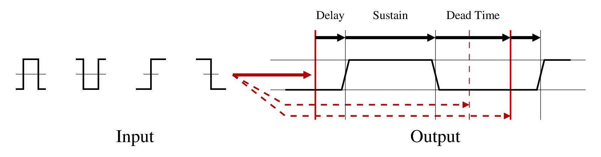

# TTL Conditional Triggering Plugin

## Overview

This plugin provides conditional triggering logic for generating trigger
events based on the combined state of several TTL inputs.

Signal flow and condition timing are illustrated below:

* Each enabled input has an associated condition:

  * Asserted while high.
  * Asserted while low.
  * Asserted after a low-to-high transition.
  * Asserted after a high-to-low transition.

* For active-high and active-low inputs, the input may need to be active for
N milliseconds before its condition is asserted (to ignore spurious events).

* Assertion may be delayed until N milliseconds after the input condition is
met ("delay time").

  * This may be a variable time between M and N milliseconds, uniformly
distributed. This is used to deliberately introduce jitter if desired.

* Asserted conditions may be held for N milliseconds, even if the input
condition ceases to be present ("sustain time").

* A condition may need to be de-asserted for N milliseconds before being
asserted again ("dead time").

* Output may be asserted if:

  * _Any_ enabled input conditions are met.
  * _All_ enabled input conditions are met.

* The output assertion conditions are processed in the same way as input
assertion conditions.

## Screenshots

## Notes

Copies of this module can be daisy-chained to produce more complicated
logical expressions (such as sum-of-products). This usually won't be
necessary.

This plugin requires the
[TTLTools](https://github.com/att-circ-contrl/PluginLibTTLTools) library
and the [RetroIcons](https://github.com/att-circ-contrl/PluginLibRetroIcons)
library.

_(This is the end of the file.)_
